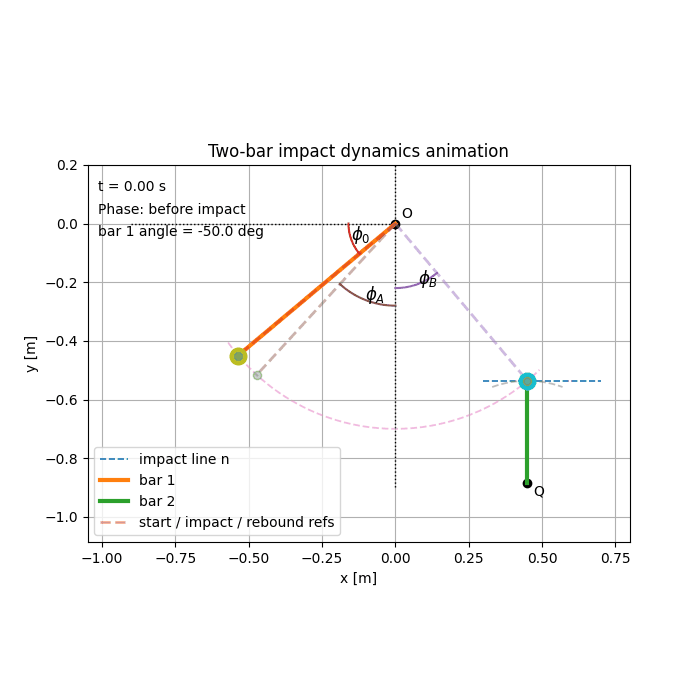
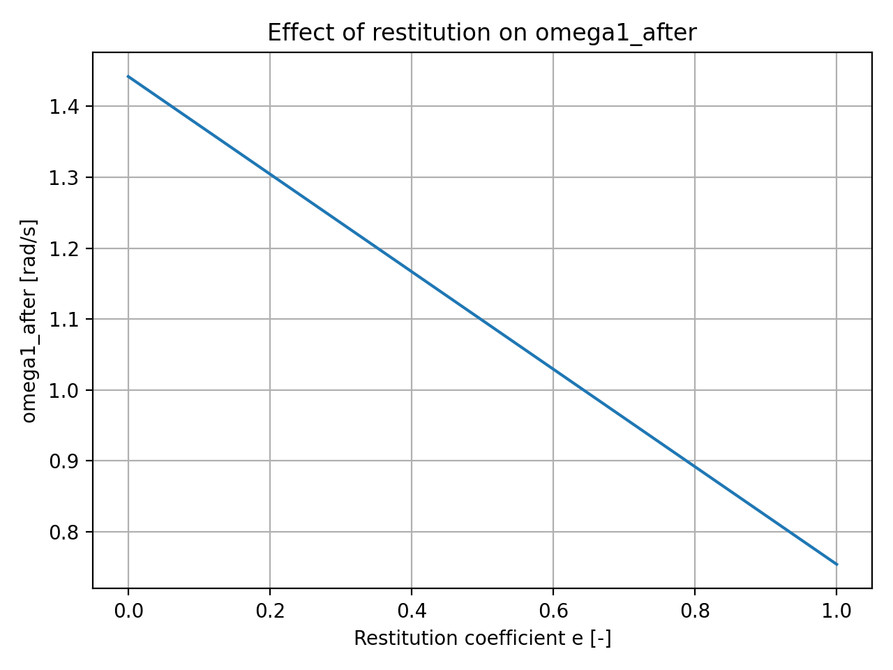
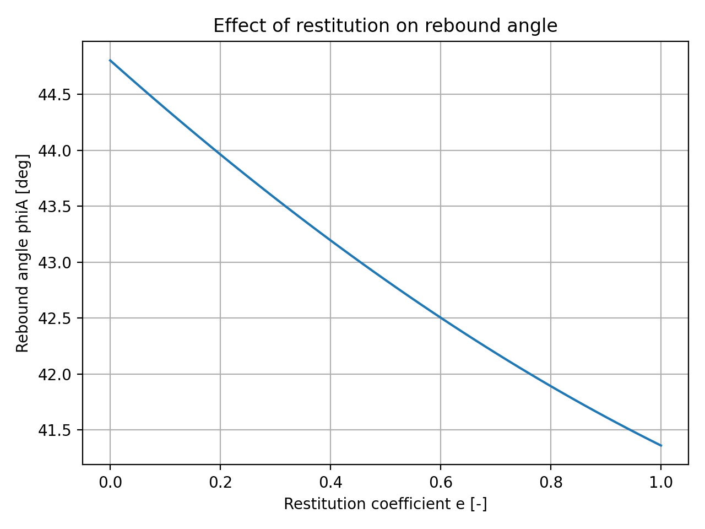

# Impact Dynamics Simulation with Restitution (Python)

## Simulation Animation

The animation below shows the simulated motion of the pendulum system after the impact event.

## Overview
This project implements a numerical solver and simulation for a pendulum-like rigid body system undergoing an impact event.

The solver computes the system response before and after collision using a **coefficient of restitution**, and the simulation visualizes the resulting motion.

## Objectives
- Model rigid-body impact dynamics
- Implement a restitution-based collision solver
- Analyze angular velocity and angle evolution after impact
- Visualize system behavior through simulation

## Engineering Approach
The system dynamics are derived using rigid-body mechanics and conservation laws.

The solver computes:
- angular velocity before impact
- angular velocity after impact
- impulse exchange during collision
- post-impact system evolution

The simulation integrates the system motion and generates plots of the resulting dynamics.

## Tools
- Python
- NumPy
- Matplotlib

## Repository Structure

impact-dynamics-simulation  
│  
README.md  
demo_run.py  
animate_system.py  

src  
- impact_solver.py  
- hw_model1.py  
- hw1.vib.py  

figures  
- e_sweep_omega1_after.png  
- e_sweep_phiA.png  

## Example Results

### Angular Velocity After Impact

### Impact Angle Response

## Running the Simulation
Run the main simulation file:

python demo_run.py

## Key Features
- restitution-based impact solver
- numerical dynamic simulation
- visualization of system motion
- analysis of impact response

## Author
Marai Abed Alrahman  
Mechanical Engineering – Budapest University of Technology and Economics

